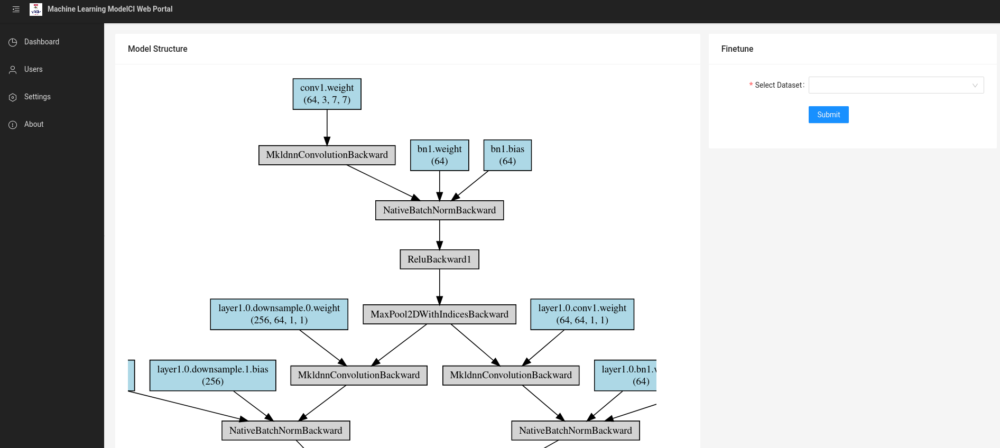

# Web Portal of ML Model CI

## Quick Start

Before getting start with the web application, you need to connect with your backend APIs (MLModelCI services). The default address is http://localhost:8000/api/v1/model. If you want to connect to your own MLModelCI service, you should modify the address before starting in `src/config.ts`.

```bash
npm install
npm start
```

## Screentshot 

### Dashboard


### Model visualization


